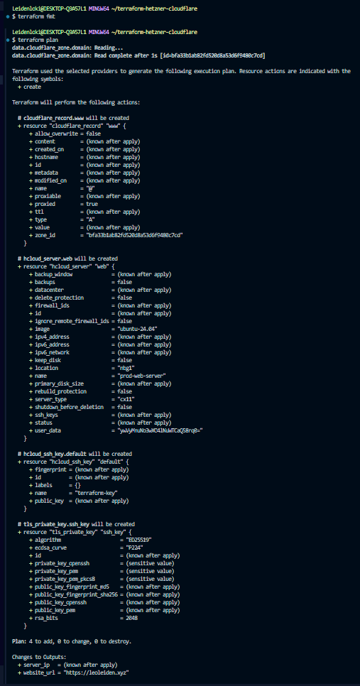
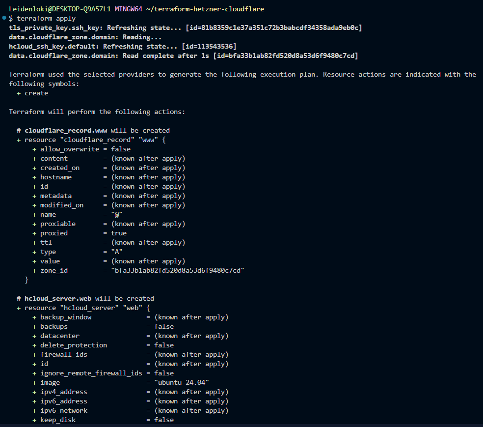
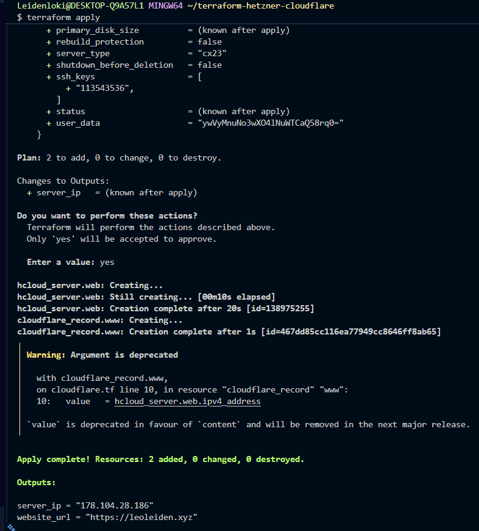
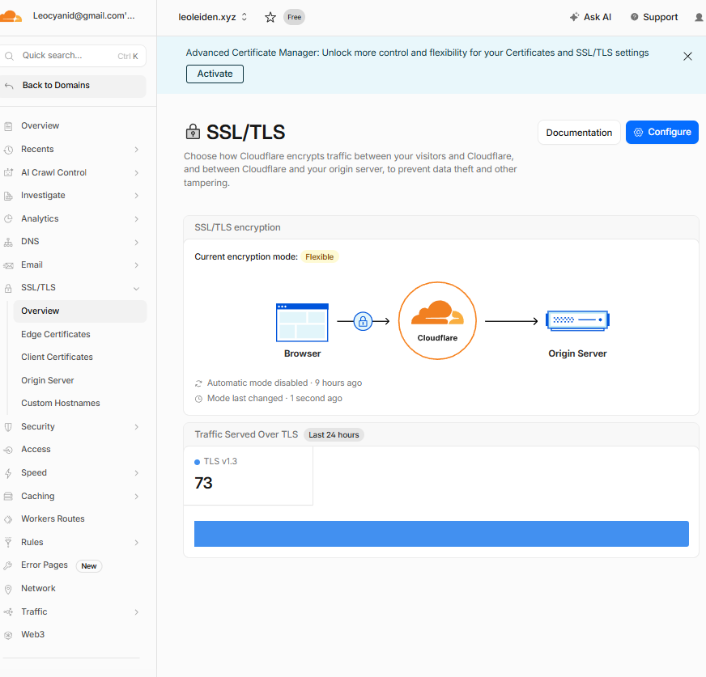
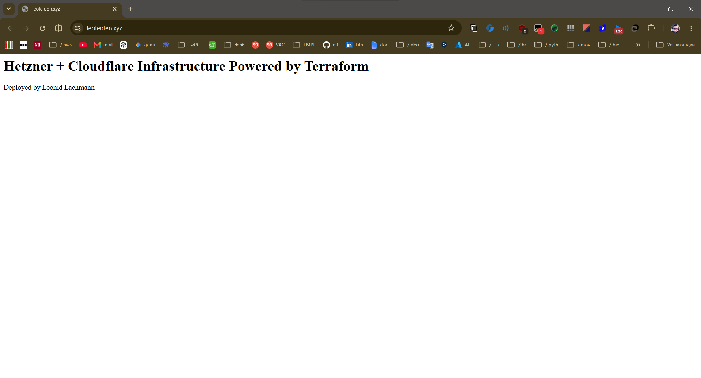
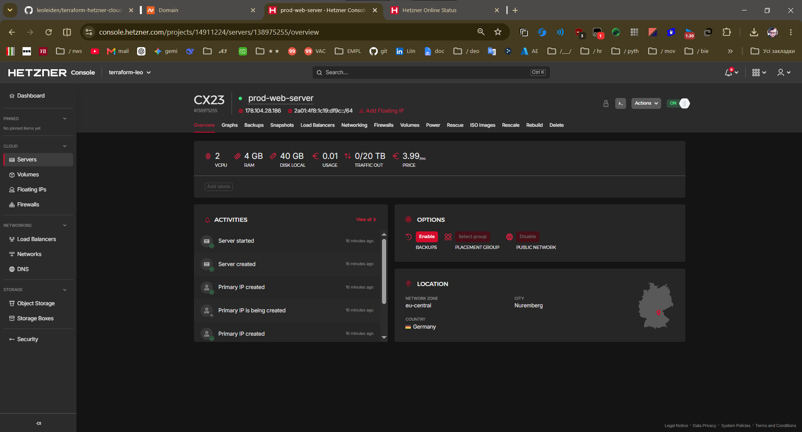
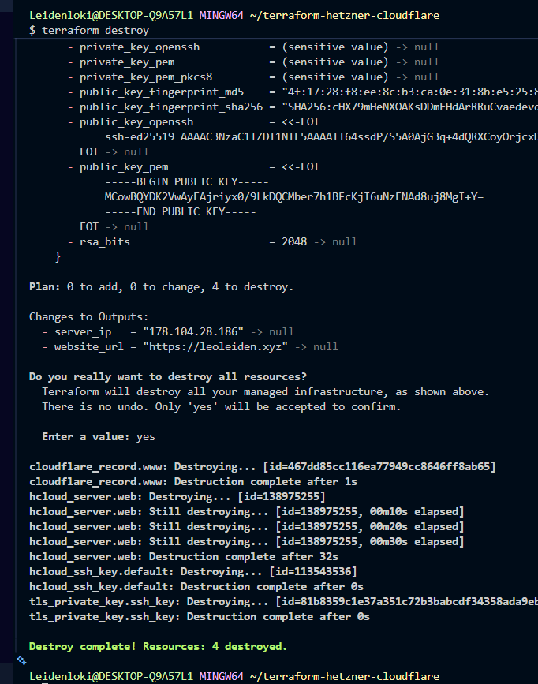

# 🌐 Automated Cloud Infrastructure: Hetzner + Cloudflare via Terraform


**Architected and implemented by Leonid Lachmann**

This repository contains an Infrastructure as Code (IaC) project that automatically provisions and configures a secure web server using Terraform. It demonstrates a fully automated deployment pipeline from zero to a secure, proxy-protected web endpoint, emphasizing cost-efficiency through ephemeral resource management.

## ⚙️ Infrastructure & Architecture

* **Automated Cloud Provisioning:** Dynamically deploys a Hetzner Cloud virtual machine (CX23 instance, Ubuntu 24.04, Nuremberg data center).
* **Zero-Touch Configuration (`cloud-init`):** Utilizes the `user_data` parameter to automatically update packages, install Nginx, and deploy a custom HTML landing page during instance initialization.
* **Dynamic DNS & Edge Security:** Automatically retrieves the provisioned Hetzner public IP and maps it to a Cloudflare zone. Traffic is routed through Cloudflare's proxy network (`proxied = true`), ensuring immediate SSL/TLS encryption (Flexible mode) and WAF protection.
* **Cryptographic Access Control:** Automatically generates and deploys ED25519 SSH keys via Terraform for secure, passwordless server access.
* **Ephemeral Cost Optimization:** Designed using the "Apply & Destroy" methodology. The entire infrastructure can be spun up for testing and completely torn down in seconds, keeping operational costs strictly optimized (under €0.01 per run).

## 🚀 Deployment & Validation

### Prerequisites
* [Terraform](https://developer.hashicorp.com/terraform/downloads) installed locally.
* A Hetzner Cloud API Token.
* A Cloudflare API Token and an active Zone ID for your registered domain.

### 1. Environment Configuration
Create a `terraform.tfvars` file in the root directory (ensure this file is ignored in `.gitignore`):

```hcl
hcloud_token         = "your_hetzner_token"
cloudflare_api_token = "your_cloudflare_token"
domain_name          = "yourdomain.com"
```

### 2. Infrastructure Execution
Execute the following commands to initialize, validate, and deploy the infrastructure:

```bash
# Initialize the Terraform working directory
terraform init

# Generate and review the execution plan
terraform plan

# Provision the infrastructure
terraform apply -auto-approve
```

### 3. Teardown & Cost Control
Once validation is complete, securely destroy all managed resources to prevent ongoing billing:

```bash
terraform destroy -auto-approve
```

## 📊 Verification Screenshots

Below is the live validation execution proving the successful deployment, security configuration, and resource cleanup of the infrastructure:

#### Initialization & Plan Verification



#### Infrastructure Provisioning


#### Security & SSL Configuration


#### Live Deployment Validation



#### Cost Optimization (Resource Destruction)


---
*This infrastructure pattern serves as a core module for building secure, automated, and cost-efficient cloud-native environments.*